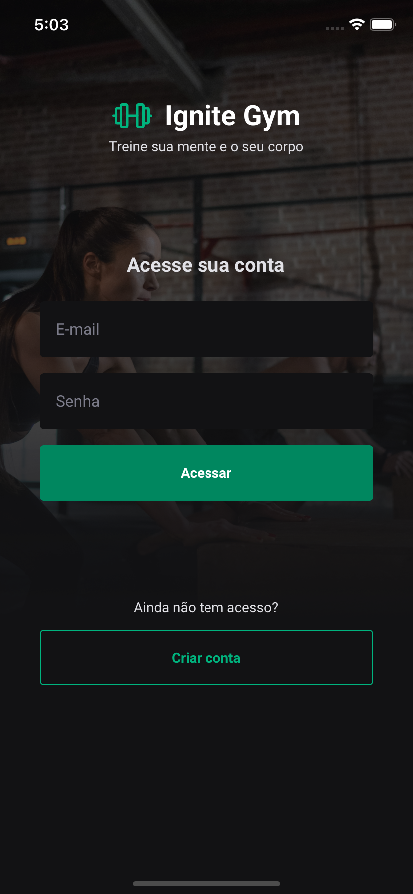

# **Ignite Gym**


## **Description**

This application was developed during the [course Ignite](https://www.rocketseat.com.br/ignite).
The application was created using Expo, and the NativeBase library was used for component styling. <br /><br />
The application allows users to view physical exercises categorized by muscle groups, record their completed exercises, and track their exercise history on a daily basis.<br />

## **Screenshots**

<div>



</div>
<div>


</div>

## **Prerequisites**

Set up the necessary environment for developing a React Native application using Expo. You can do this according to the official [documentation](https://reactnative.dev/docs/environment-setup?guide=quickstart).

#### **Backend**

You will need the backend (provided by [Rocketseat](https://www.rocketseat.com.br/)) to access the application (create a user and authenticate). You can run it by following the steps below:

```bash
# Clone the project
$ git clone https://github.com/rodrigorgtic/ignitegym-api

# Access the folder
$ cd ignitegym-api

# Install the dependencies
$ npm install


# Change de api address
# Open the file 'api.ts' located in the path 'src/services/api.ts' and change the 'baseURL' to your local ip address.


# Start the project
$ npm start
```

## **Instalation**

```bash
# Clone the project
$ git clone https://github.com/leandrodsi/ignite-gym.git

# Access the folder
$ cd ignitegym

# Install the dependencies
$ npm install

# Start the project
$ npm start

```

## **Contribution**

The project was developed for learning purposes only. If you want to contribute with any improvement (code or idea) or provide constructive criticism, feel free to use the [issues](https://github.com/leandrodsi/ignite-gym/issues) tab.

## **Contact**

📞 <a href="tel:+351933968325">+351 933 968 325</a> <br />
 ✉️ <a href="mailto:leandrodsystems@gmail.com">leandrodsystems@gmail.com</a>
